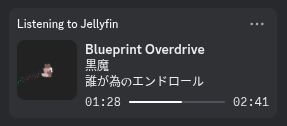
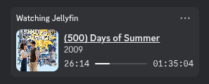

# Jellyfin Rich Presence for Vencord

 

### Implemented

- [X] Music
- [X] Movies
- [ ] TV Shows
- [ ] Books

## Installation

- Follow the instructions to make a [Vencord Development Installation](https://docs.vencord.dev/installing/)
- Create a `userplugins` folder in `Vencord/src`, if it doesn't already exist
- In `Vencord/src/userplugins`, `git clone https://github.com/sproutsberry/vencord-jellyfin-rpc.git`
- Rebuild Vencord by running `pnpm build` in your root `Vencord` folder

To update Vencord or Jellyfin Rich Presence, run `git pull` in your `Vencord` or `Vencord/src/userplugins/vencord-jellyfin-rpc` folders respectively.
